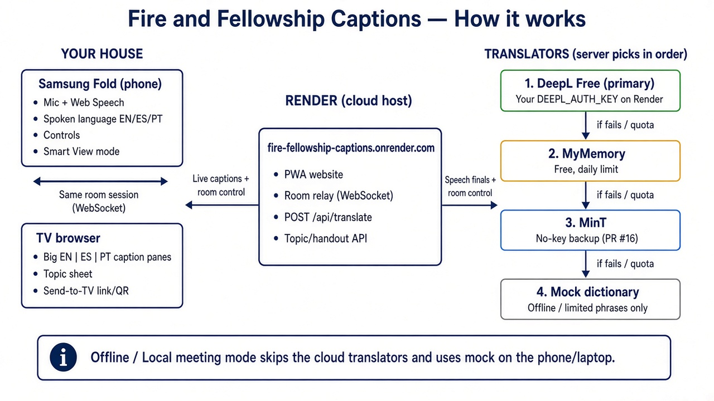

# Fire and Fellowship Captions

Live speech captions for **Men's Fellowship**, plus the **topic of the day**. A phone captures the speaker and chooses the meeting topic; a TV (any browser) joins the same room and shows the verse, a short handout, and English / Spanish / Portuguese caption windows.

This is one caption app. The topic list is a small built-in seed in this repo — not another product.

**Meeting night shape:** install **Fire and Fellowship** on the Galaxy Z Fold 7 from a public HTTPS URL (Chrome → Install app). Open the same URL on the TV. No git, no `npm run dev`.

## How it works



- **Phone (Samsung Fold):** Chrome / the installed PWA captures the speaker with the mic (Web Speech), sets spoken language **EN / ES / PT**, picks the topic, and owns the controls — including **Smart View mode** when the TV will only mirror the Fold.
- **TV browser:** joins the same room and shows the big **EN | ES | PT** caption panes plus the topic sheet. **Send to TV** gives a QR / link so the TV’s own browser opens that room.
- **Same-room WebSocket:** phone and TV stay in sync through the room relay on the public host (live captions, topic, layout). They must hit the **same** process.
- **Render host** (`fire-fellowship-captions.onrender.com`): one Node process serves the PWA, the WebSocket room relay, `POST /api/translate`, and the topic / handout API.
- **Translators (server order):** DeepL Free first when `DEEPL_AUTH_KEY` is set on the host → MyMemory (free, daily limit) → MinT (Wikimedia, no key) → built-in mock dictionary (limited phrases). Keys stay on the server.
- **Offline / Local meeting:** skips the cloud translators and uses the mock dictionary on the phone / laptop so a meeting can run without public internet.

## Install on the Fold (Chrome on Android)

Freddy’s phone: **Samsung Galaxy Z Fold 7**, **Chrome** (not Samsung Internet). Web Speech and Add to Home Screen are reliable in Chrome.

1. Deploy once (see [Host a public URL](#host-a-public-url)) so you have an `https://…` link.
2. On the Fold, open that URL in **Chrome**.
3. Install like a normal app:
   - If the page shows **Install app**, tap it and confirm.
   - Or tap Chrome’s menu **⋮ → Install app** / **Add to Home screen**.
4. Open **Fire and Fellowship** from the home-screen icon. It should launch **standalone** (no Chrome address bar).
5. Tap **Create room on this phone**. That phone/control + mic route is the same PWA — it stays in the installed app.

Keep Chrome (or the installed PWA, which is Chrome) in the **foreground** while speaking. Allow the microphone when asked.

## Open on the TV (meeting night)

There are **two** ways to get captions on the TV. They are not the same thing.

### Send to TV (QR + link) — TV’s own browser

The TV opens the caption page in **its own browser**. The Fold stays on topic + mic control. Phone and TV stay in sync over the room.

1. On the Fold, open Fire and Fellowship in **Chrome** (or the Chrome-installed app) and create a room.
2. Tap **Send to TV**. That stays on the mic page and shows:
   - A large QR code of this room’s TV caption URL
   - **Copy TV link**
   - Short steps: on the TV browser, open this link or scan the QR; keep the Fold on the mic page
3. On the TV browser, scan the QR or paste the copied link (`/?view=tv&room=ABCD`).
4. **Open TV view** on the phone is only for testing on this device. It is not the meeting-night path.

Any TV browser (or a laptop HDMI’d to the TV) works. Phone and TV must use the **same public host**.

### Smart View mode — mirror the caption layout

Samsung Smart View (quick panel → **Smart View** → **My TV**) can **only mirror the Fold screen**. If the Fold is showing the control / mic UI, the TV shows that. The app cannot open a separate caption page through system Smart View, and it does **not** auto-launch Smart View or Cast intents.

**Smart View mode** switches the Fold itself to the same big caption windows as the TV page, plus the **EN | ES | PT topic sheet** when **Captions only** is off, while speech recognition **keeps running**. Then you open system Smart View from the Fold quick panel so the TV mirrors that view.

1. Create a room, pick today’s topic, and start the mic if you want (or start it after you enter the mode).
2. Tap **Smart View mode**. The Fold leaves the control UI and shows the caption windows.
3. A small always-visible bar keeps **Captions only**, **Start / Stop** (mic), and **Exit Smart View mode**. **Captions only** is on by default so the mirror is just the three language windows; turn it off to show the topic handout again. The choice is remembered for this browser session. Rotate the Fold: landscape keeps **EN | ES | PT** in a row; portrait keeps all three panes on screen as stacked rows. A 1-language or 2-language TV layout still follows the picker.
4. The tip on screen: “Now open system Smart View → My TV. TV will mirror these captions.” Use the Fold **quick panel Smart View tile** — do not expect the app to launch it.
5. Tap **Exit Smart View mode** to return to the normal phone controls. The mic does **not** stop just because you entered or left this mode.

Use **Send to TV** when the TV can run a browser. Use **Smart View mode** when you will mirror from the Fold because that is all Samsung Smart View can do.

### Same room, two browsers

1. On the Fold app, note the 4-letter room code, or tap **Send to TV** → **Copy TV link**.
2. On the TV browser, open the **same public URL**.
3. Enter the room code and tap **Open TV windows**, or paste the copied TV link.
4. On the Fold, pick **Topic of the day** (try **Contentment** or **Brotherhood**) or type a topic / verse and tap **Set**. The TV should show the talk sheet in three columns (**EN | ES | PT**) — verse, hook, teaching, and discussion questions — above the caption windows.
5. Tap the mic on the Fold and speak (or type a caption). Captions should appear on the TV in the layout you chose:
   - One language, full-screen
   - Dual columns (`EN | ES`, `EN | PT`, or `ES | PT`)
   - Triple columns (`EN | ES | PT`)

Phone and TV must use the **same public host**. The room lives in memory on that one server — nothing is stored, and there is no account.

## Host a public URL

### Chosen deploy shape: one Node process

The app is a Vite frontend plus an in-memory WebSocket relay at `/caption-ws` (`server/relay.ts`). Phone and TV stay in sync only if they connect to the **same process**.

Production is therefore **one small Node server** (`server/index.ts`) that:

- Serves the built PWA from `dist/` (HTTPS is terminated by the host)
- Attaches the same relay used in `npm run dev`
- Exposes `GET /health` for the host’s checks

```bash
npm install
npm run build
npm start          # PORT=8080 HOST=0.0.0.0 by default
```

**Keep exactly one instance.** Two replicas (or two serverless isolates) mean the Fold and the TV can land on different memories and never see each other.

**Why not Vercel alone?** Vercel Functions can speak WebSockets, but a new connection is not guaranteed to reach the same isolate, and Hobby connections close at the function time limit (minutes, not a whole meeting). Making that work needs an external pub/sub (Redis, etc.). This repo does not fake that. A single Fly / Railway / Render process is the reversible path.

Split hosting (static files on one CDN + a durable websocket box) would also work if you pointed the browser at one origin; it is more moving parts than Freddy needs.

### Fly.io (preferred default)

Cheap, HTTPS, WebSockets, scale-to-zero when idle.

1. Install the [Fly CLI](https://fly.io/docs/flyctl/install/) and run `fly auth login`.
2. From this repo:

   ```bash
   fly launch --ha=false --copy-config --yes
   fly deploy --ha=false
   fly scale count 1
   ```

3. If the app name `fire-fellowship-captions` is taken, change `app` in `fly.toml` (or the name `fly launch` prints) and deploy again.
4. Fly prints `https://<app>.fly.dev`. That is the meeting-night URL.

`fly.toml` is set to **one 256 MB machine**, `force_https`, and `/health`. `auto_stop_machines = "stop"` sleeps when idle (first open after a pause can take a few seconds). To avoid a cold start on meeting night, either open the URL a minute early or set `min_machines_running = 1` for the evening.

Do not deploy mid-meeting (a new machine can drop the in-memory room).

### Railway

1. New project → deploy this repo.
2. Railway should pick up `railway.toml` + `Dockerfile` (`npm run build` then `npm start`).
3. Generate a public HTTPS domain in the service settings.
4. Replicas: **1**. Railway injects `PORT`. Add `TRANSLATE_PROVIDER=deepl` and `DEEPL_AUTH_KEY` for meeting night; without them the app uses MyMemory (no key).

### Render

1. New **Web Service** (not a Static Site) from this repo, or apply `render.yaml`.
2. Build `npm ci && npm run build`, start `npm start`, Node 22.
3. Free instances sleep; open the URL a minute before the meeting.
4. Instance count: **1**.

### After you have the URL

Install on the Fold ([above](#install-on-the-fold-chrome-on-android)). Bookmark the same URL on the TV browser if you want.

No Play Store APK. Chrome’s installed PWA is the app format.

## Travel: Offline / Local meeting

Freddy sometimes has **no public internet**. Use **Offline / Local meeting** in the app (home and phone). That preference is saved in `localStorage`.

**On:** captions use the built-in mock dictionary (limited EN/ES/PT phrases). No MyMemory, no DeepL, no keys. A banner says: *Offline translate (limited phrases). For full local setup see laptop steps.*

**Off:** current hosted default — MyMemory on Render, then MinT if that quota is gone (or DeepL if a server key is set). The limited-phrase banner stays hidden while MinT or MyMemory is actually translating.

### Laptop LAN / hotspot (Fold + TV)

On a laptop that can share Wi‑Fi or a phone hotspot with the Fold and the TV:

```
npm install
npm run build
npm start
```

`npm start` listens on **port 8080** (`HOST=0.0.0.0`). Then open `http://LAPTOP-LAN-IP:PORT` on the Fold and the TV — usually `http://192.168.x.x:8080` — while they are on that same network.

Optional laptop env (same mock dictionary the in-app toggle uses):

```bash
TRANSLATE_PROVIDER=mock
```

Use **Chrome** for the mic. Speech recognition may still need a network path to the device’s speech service (Chrome / Google), depending on the phone. That is not fully offline. **Type a caption** and Send if the mic cannot reach a recognizer.

Smart View, Send to TV, topics, captions-only, trilingual sheets, and the footer credit are unchanged. Phone and TV still need to reach **this laptop’s** process for the room relay — they cannot stay on the public Render URL if that host is unreachable.

## Verify phone + TV in the production shape

After `npm run build`, either locally or against the public URL:

```bash
npm run verify:prod
npm run verify:prod -- https://YOUR-APP.fly.dev
```

The script checks:

- `/health` is OK
- `/` and `/?view=phone&room=ABCD` / `/?view=tv&room=ABCD` serve the app shell (so the home-screen icon can open both routes)
- Manifest: name **Fire and Fellowship**, short name, standalone, theme, 192/512 icons
- Service worker registers a `fetch` handler and does not intercept `/caption-ws`
- Two WebSocket clients in room `ABCD`: a phone **topic of the day** push arrives on the TV

**Meeting-night dry run on the real URL**

1. Fold (installed app or Chrome): create a room, set topic **Brotherhood**.
2. TV: open the TV link. Confirm the **EN | ES | PT** talk sheet above the caption windows.
3. Type `Welcome brothers. Thank you for coming tonight. Let us begin.` on the Fold (or speak). Confirm captions on the TV.
4. Status pills: Fold shows **TV connected**; TV shows **Phone connected**.
5. On the Fold, tap **Smart View mode**. The phone should switch to the EN/ES/PT caption windows (topic hidden while **Captions only** is on). Rotate to landscape: all three windows stay in a row. Portrait: all three stay visible (stacked). The mic should keep its current Start/Stop state. Tap **Captions only** off to show the EN | ES | PT topic sheet, then **Exit Smart View mode** to get the controls back.

If the TV stays on **Waiting for phone**, you are on two different hosts or more than one server instance.

## Topic of the day

Freddy sets the day’s Bible / Christian topic on the **Fold**. The TV only displays it. This is unchanged in production: the phone pushes room state over the relay, including `topic`.

**Pick:** tap a built-in topic (Contentment, Head of the household, Brotherhood, Integrity, Courage, Work, Self-control, Forgiveness, Humility, Accountability, Servant leadership, Faith in trials). The phone preview stays in the spoken / UI language. The **TV page** and **Smart View** (when **Captions only** is off) show the same sheet in **three columns: EN | ES | PT**. Each column has the same structure: **bold verse reference**, *italic Scripture*, **bold hook**, short teaching, then numbered **Discussion Questions**. When Captions only is on, Smart View stays captions-only (three caption windows).

**Ask for topic:** type a theme in the box (`head of household`, `contentment`, `forgiveness`) and tap **Ask for topic** (or press Enter). That is the main action — it finds a seeded sheet when one matches, otherwise the server writes a handout. Loading + Cancel are available. The sheet is set as the room topic and pushed to the TV / Smart View.

**Set:** still there for a typed title that should go to the TV as-is if you do not want a generated sheet.

Examples that resolve to seed data:

- `head of household`
- `headship`
- `husband`
- `contentment`
- `Philippians 4:11-12`
- `brotherhood`
- `Proverbs 27:17`

Generated sheets use catalog Scripture in EN / ES / PT (KJV, Reina-Valera, Almeida — not invented, not machine-translated). Teaching, hook, and questions are written in English and then filled into ES / PT through the same translate pipeline as captions (DeepL / MyMemory / MinT / mock). If the request matches a built-in seed, that seed is used. Otherwise the server writes a handout from the curated catalog. No API key is required. Optional `OPENAI_API_KEY` (and `OPENAI_MODEL`, default `gpt-4o-mini`) upgrades the teaching quality; verse wording still comes from the catalog, never from the model. If the key is missing or the call fails, the offline generator is used.

Seeded talk sheets (head of the household and the rest of the built-in list) include full EN / ES / PT for verse, hook, teaching, and discussion questions. Empty translations still fall back to English. Caption windows follow the TV layout chips; the topic sheet does not — it stays **EN | ES | PT**. To add or edit the built-in set, change `src/topics.ts` (offline, no API keys). To add verses the generator can pick, change `server/scripture-catalog.ts`.

## Galaxy Z Fold 7 + Chrome

- Open (or install) in **Chrome**. Samsung Internet, Firefox, and in-app browsers usually will not capture live speech or offer a solid install.
- **Send to TV** (QR / copy link) puts the caption page on the TV’s own browser and leaves the Fold on mic / controls.
- **Smart View mode** is for system Smart View mirroring: the Fold becomes the caption display so My TV does not mirror the control UI. Open Smart View from the Fold quick panel; this app does not launch it. Use **Captions only** to hide the topic handout on that mirrored view.
- Allow microphone access. Keep the app in the foreground. If the screen sleeps or you switch apps, tap **Start** again.
- Unfolded: topic + mic on one side, language / TV layout / captions on the other.
- Cover screen: same controls, stacked, with the mic docked in the thumb zone.
- Flex / book-stand: columns follow the two screen segments when Chrome reports them.
- Stand the Fold near the speaker.

## Mic tip

- Use **Chrome** or the Chrome-installed PWA. Do not use Samsung Internet for the mic.
- Allow microphone permission when prompted.
- Stand close; continuous recognition pauses in silence and then resumes.
- If the mic is blocked or unavailable, type a caption instead.
- Caption windows (phone preview, Smart View mode, and the TV page) show **finished sentences only**. Partial speech-to-text drafts do not stack in the history. While you speak, the phone may show a single “Listening…” / live line that replaces itself; translations run when the sentence is final.

Demo line (works on DeepL, MyMemory, and the built-in mock dictionary):

> Welcome brothers. Thank you for coming tonight. Let us begin.

## Translation / env

The phone translates **before** it sends captions to the TV. The Fold calls `POST /api/translate` on the same host. Source language → the other TV windows (**EN / ES / PT**, any direction). Keys stay on the server. Do **not** put `DEEPL_AUTH_KEY` or a Google key in any `VITE_*` variable.

**Recommended meeting-night path: [DeepL API Free](https://www.deepl.com/pro-api).** Create a Free plan account, copy the auth key, set it on the host, restart. No Google Cloud billing admin. Portuguese **targets** use DeepL `PT-BR` (Brazilian Portuguese, matching the topic seeds). English targets use `EN-US`. Free keys end with `:fx` and use `https://api-free.deepl.com`. If DeepL errors or the monthly Free quota is hit, that request falls back to MyMemory, then MinT, then mock.

**If the DeepL key is missing:** [MyMemory](https://mymemory.translated.net/doc/spec.php) (free, no key, about 5,000 characters/day per host IP). If MyMemory returns quota/error/identity, the server tries [MinT](https://www.mediawiki.org/wiki/MinT) (Wikimedia, no key) before the mock dictionary. Hosted demos still translate free-form ES/PT/EN without secrets.

**Mock** (`TRANSLATE_PROVIDER=mock`, or the in-app **Offline / Local meeting** toggle) is the offline built-in EN/ES/PT dictionary. The phone uses that dictionary locally so captions do not call MyMemory. `POST /api/translate` also accepts `provider: "mock"` (the only client override) so a laptop server can force mock without env or keys.

**Google Cloud Translation** needs a **billing admin** on a GCP project. Skip it unless someone can enable billing.

**Never commit secrets.** Copy `.env.example` to `.env` for local runs.

| Server env | Behavior |
| --- | --- |
| `TRANSLATE_PROVIDER=deepl` + `DEEPL_AUTH_KEY` | DeepL (recommended). Default host `https://api-free.deepl.com`. Optional `DEEPL_API_URL=https://api.deepl.com` for Pro. |
| *(unset)* or `TRANSLATE_PROVIDER=mymemory`, or DeepL requested with no key | MyMemory first. No key. Failures fall through to MinT, then mock. |
| `TRANSLATE_PROVIDER=mint` | Skip MyMemory; use MinT (no key), then mock. |
| `TRANSLATE_PROVIDER=mock` | Built-in dictionary. Works offline, no keys. Same path as in-app **Offline / Local meeting**. |
| `TRANSLATE_PROVIDER=google` + `GOOGLE_TRANSLATE_API_KEY` | Cloud Translation API v2. Failures fall back to MyMemory, then MinT, then mock. |
| *(unset)* `OPENAI_API_KEY` | Offline “Ask for topic” generator. Curated KJV + templates. |
| `OPENAI_API_KEY` (+ optional `OPENAI_MODEL`) | Better teaching text. Verse wording still comes from the KJV catalog. Falls back offline if the call fails. |

`GET /health` and `GET /api/translate` report the provider actually serving captions (`deepl`, `mymemory`, `mint`, `google`, or `mock`) — not a stale default after MyMemory quota is gone. `"topic"` is `"openai"` or `"offline"`. Neither endpoint returns a key. After setting a DeepL key and restarting, confirm `"translate":"deepl"`. The phone **Offline translate** banner appears only when captions are actually on the mock dictionary (the Offline / Local meeting toggle, or a total MT failure).

```bash
# Meeting night — DeepL Free (set your real key; do not invent one)
TRANSLATE_PROVIDER=deepl
DEEPL_AUTH_KEY=

# Hosted demo without secrets
TRANSLATE_PROVIDER=mymemory

# Offline laptop
TRANSLATE_PROVIDER=mock
```

Optional: `MYMEMORY_EMAIL=you@example.com` (a contact email, **not** an API key) raises MyMemory's daily cap. `npm run verify:translate` checks provider selection, DeepL language mapping, MinT parsing, and live MinT EN↔ES↔PT (`--offline` skips live calls).

### DeepL API Free auth key

1. Open [DeepL API plans](https://www.deepl.com/pro-api) and create an account on the **Free** plan (API Free). This is the unpaid-ish path — no Google billing.
2. In the DeepL account, open **API Keys** and copy the authentication key. Free keys end with `:fx`.
3. On the host, set env and **restart** the app (secrets are read at process start):

   ```bash
   # Fly
   fly secrets set TRANSLATE_PROVIDER=deepl DEEPL_AUTH_KEY=your-deepl-key-here

   # Railway / Render: add the same two variables in the service env UI, then redeploy/restart.
   ```

   Local `.env` (gitignored):

   ```bash
   TRANSLATE_PROVIDER=deepl
   DEEPL_AUTH_KEY=your-deepl-key-here
   # Optional. Leave unset for Free (api-free.deepl.com). Pro:
   # DEEPL_API_URL=https://api.deepl.com
   ```

   Then `npm run dev` or `npm run build && npm start`.

4. Confirm `GET /health` shows `"translate":"deepl"`. On the Fold, speak or type a caption — the TV windows should fill in the other languages.

### Optional: Google Cloud Translation API key

Only do this if a **billing admin** can enable billing on a Google Cloud project. Freddy cannot turn Cloud Translation on without that. Prefer DeepL Free above.

1. In [Google Cloud Console](https://console.cloud.google.com/), create or pick a project and enable billing.
2. **APIs & Services → Library** → enable **Cloud Translation API**.
3. **APIs & Services → Credentials → Create credentials → API key**.
4. Restrict the key if you can:
   - **API restriction:** Cloud Translation API only.
   - **Application restriction:** none is typical for a server key. If your host has a stable egress IP, restrict to that IP. Do **not** use HTTP-referrer restriction — the key is used from the Node server, not the Fold browser.
5. On the host, set `TRANSLATE_PROVIDER=google` and `GOOGLE_TRANSLATE_API_KEY`, then restart. Confirm `GET /health` shows `"translate":"google"`.

Optional client-only overrides (`VITE_TRANSLATE_PROVIDER=passthrough` / `mymemory` / `libretranslate` / `mock`) still exist for local experiments. Leave them unset so production uses `/api/translate`.

Speech-to-text is the Web Speech API on the phone (`src/stt/web-speech.ts`).

## Layouts (phone control → TV)

The Fold owns the caption layout. The TV only displays it. Caption windows follow those chips (one, two, or three languages). The topic / talk sheet is always three columns — **EN | ES | PT** — on the TV page and in Smart View when the topic is visible.

## Scripts

```bash
npm run dev          # HTTPS Vite + relay (LAN Fold mic, self-signed cert)
npm run dev:http     # HTTP, localhost-friendly
npm run build        # typecheck + production bundle
npm start            # production server: static PWA + relay (use after build)
npm run preview      # Vite preview + same relay (local production bundle)
npm run verify:prod       # PWA + relay checks (optional public URL argument)
npm run verify:translate  # DeepL/MyMemory/MinT selection + EN/ES/PT live pairs
```

Local LAN Fold testing still works with `npm run dev` (Chrome will warn about the self-signed certificate — **Advanced → Proceed**). Meeting night should use the public HTTPS URL so there is no laptop in the loop.

## PWA notes

- Manifest: **Fire and Fellowship** name and short name, standalone display, theme `#120c09`, 192/512 (any + maskable) icons.
- Service worker: offline app shell (HTML/CSS/JS/icons/fonts after first load). Live captions still need the network so the relay can reach the TV.
- `start_url` is `/`. Phone and TV are query routes (`/?view=phone&room=ABCD`, `/?view=tv&room=ABCD`) inside that scope, so both work from the installed icon and from copied links.
